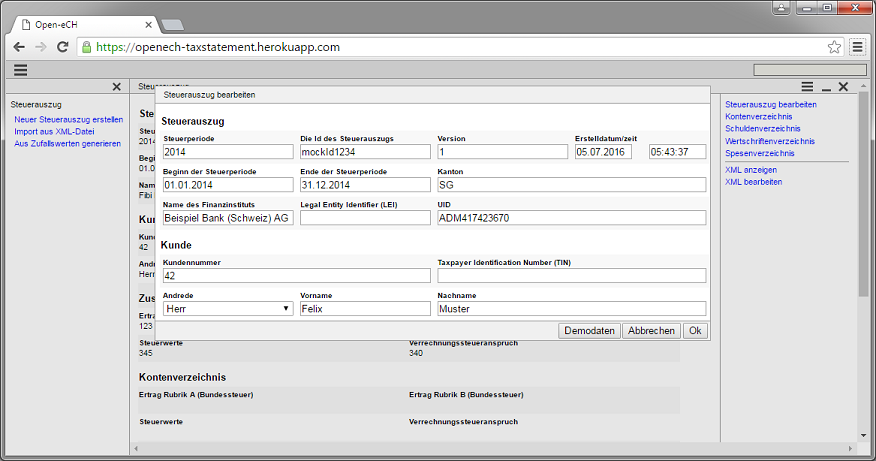

= Open-eCH: Elektronischer Steuerauszug

Der von eCH definierte Standard beschreibt das Austauschformat zum elektronischen Steuerauzug. Dieser wird
den natürlichen Personen mit Steuerdomizil Schweiz von den Finanzinstituten für die Zwecke des Privatvermögens
zur Verfügung gestellt.

link:http://openech.ch/produkte.html[Offizielle Produktseite]

== Technische Hinweise zu der Implementierung

=== Java

Es wird Java 8 verwendet. Die neueren Features werden nicht extensiv genutzt, aber z.B. LocalDate wird verwendet.

=== Minimal-J

Die Basis der Applikation ist das Framework link:http://minimal-j.org[Minimal-J]. Minimal-J hat selber nur wenige
Abhängigkeiten, sodass das ganze Projekt aus einer übersichtlich kleinen Anzahl an Klassen besteht

=== Datenmodell

Im package ch.openech.model.tax befinden sich die Klassen die das Datenmodell repräsentieren. Die Namen der
Klassen und der Felder entsprechen denen aus dem XML Schema des Standards.

Daher konnte das Einlesen und Schreiben der XML Files sehr einfach gehalten werden. Die entsprechenden Reader/Writer
finden sich in dem package ch.openech.xml .

=== Open-eCH

Einige Klassen werden aus der Register Applikation von Open-eCH verwendet. Da dazu noch kein offizielles Release
Management besteht befinden sich eine Teilmenge der Klasse in einem lokalen Repository.

=== Kontakt

* Bruno Eberhard, mailto:bruno.eberhard@pop.ch[mailto:bruno.eberhard@pop.ch] 